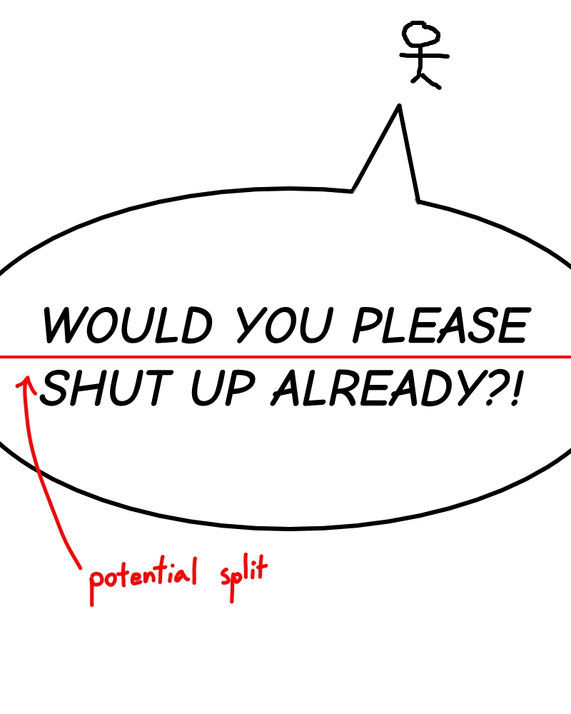
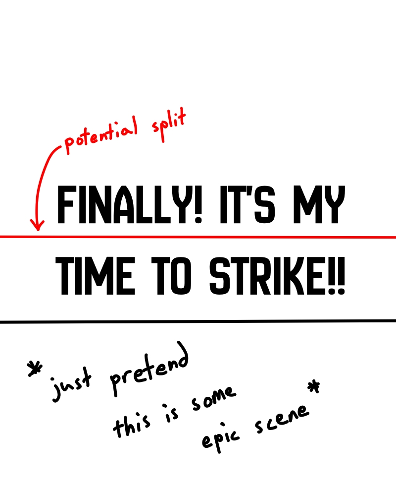

# Quickstitch

Another program for stitching together manhwa/manhua/manga/webtoon raws.

Has a cross-platform GUI built with the [Iced](https://github.com/iced-rs/iced) GUI library. Also usable as a Rust crate.

Check out the [roadmap](./docs/roadmap.md) and the [user guide](./docs/user_guide.md)!

## Why make another program?

If you're here, you may know about [SmartStitch](https://github.com/MechTechnology/SmartStitch/).

Over the last ~2 years, SmartStitch has been super useful to me and many others. I've actually built a few scripts around it for personal use, specifically as part of a semi-automated upscaling pipeline.

That said, there are a few reasons why I decided to create an alternative from scratch:

### 1. Edge Cases

SmartStitch's "Smart Pixel Comparison" only checks one row of pixels at a time. This means that SmartStitch may sometimes think it's okay to split pages at the gap between lines of text.

Here are some examples of such cases that I have actually come across, although I have recreated them to avoid copyright issues.

*(hey, I never claimed I was an artist, okay...)*

To avoid this, the split line finder for Quickstitch should check the results of consecutive scan lines to ensure the split line found is not in the middle of a text block. It's still not perfect, and which brings us to the next point:

2. Restitching is a Pain

Due to the point mentioned above, I usually have to double-check the results of SmartStitch. The main issue with this is when I do manage to spot a problem, I need to restitch. However, I'm not exactly great with art programs (if you haven't already realized that from the images above), so my method is just to modify the "Rough Output Height" by small amounts to convince the program to make a split elsewhere. However, even that method has its limits. A while ago, I came across a chapter which contained loads of unboxed text. With each restitch I did, another block of unboxed text got split in the middle.

Therefore, with this program, there should be a simple GUI for manually restitching (and while I'm at it, double checking).

### 3. Dependencies

This isn't a problem for most users as SmartStitch is available in the form of a bundled executable, but since I want to build some additional programs/scripts around it, I have to use the SmartStitch Core files, which require `natsort`, `numpy`, and `pillow` to be installed through pip. Sure, it isn't a lot of work, but this means extra setup steps if I were to, say, run my program on a VPS.

Since Quickstitch is built with Rust and is available as both a library and a binary, dependencies will be installed with just a `cargo build`.

(**Edit:** I just found out about the `setup.py` file bundled with SmartStitch, so I guess this point isn't as strong anymore. Regardless, I still think `cargo build`/`cargo run` is more streamlined for getting things set up and running.)

### 4. Performance

SmartStitch is by no means untolerably slow, but since processors have more than one core these days, I want Quickstitch to take advantage of multithreading (which SmartStitch couldn't easily add support for even if it wanted to due to Python's GIL, at least up until now) due to [rayon](https://github.com/rayon-rs/rayon) making it pretty simple, at least for a simple multithreading implementation. This by no means guarantees that Quickstitch will be faster than SmartStitch, but it's worth a shot.

Additionally, since Rust is compiled, Quickstitch should also be able to reap the benefits of compile-time optimizations.

## Acknowledgements 

Special thanks to [Leafsky](https://www.instagram.com/_.melo.vee._/) for giving me permission to use her comic as a test sample!
